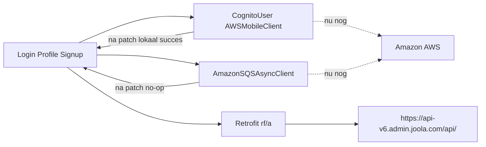

# Amazon-verkeer uit iPong halen

De app praat al via Retrofit naar `https://api-v6.admin.joola.com/api/` ([smali_classes2/un/a0$a.smali](smali_classes2/un/a0$a.smali)). Login is deels gebypasst met statische JWTs, maar **Cognito login/signup/attributes, Hosted UI, SQS-analytics en S3-URL-prefixes** raken Amazon nog. We houden de bestaande Cognito-types en UI, en knippen het netwerk af in de SDK — dezelfde stijl als [apk-infinity/src/tasks/smali/patches.ts](D:/GitProjecten/pinfinity_android/apk-infinity/src/tasks/smali/patches.ts).

Keuzes: **HTTPS blijft**, **SQS wordt een no-op**.

## 1. Cognito: geen netwerk meer naar Amazon

Bestaande patches in [CognitoUser.smali](smali/com/amazonaws/mobileconnectors/cognitoidentityprovider/CognitoUser.smali) (`s()`, `C()`, constructor) en [CognitoUserSession.smali](smali/com/amazonaws/mobileconnectors/cognitoidentityprovider/CognitoUserSession.smali) blijven. Extra stubs zodat **geen enkele Cognito-handler nog `cognito-idp.us-east-1.amazonaws.com` aanroept**:

In `CognitoUser.smali`:

- `w` / `v` (login + silent refresh): niet `CognitoUser$5` starten. Direct `s()` aanroepen en `AuthenticationHandler.c(session, null)` (onSuccess) — o.a. [ui/e.smali](smali/com/joolarobot/ipong/ui/e.smali) en [ui/b.smali](smali/com/joolarobot/ipong/ui/b.smali).
- `u` / `y` (GetUser): geen `GetUserRequest`. Fake `CognitoUserDetails` met e-mail `infinity@nowhere.com` zodat [c$a$e.smali](smali/com/joolarobot/ipong/ui/c$a$e.smali) niet hangt.
- `I` (update attributes), `r`/`n` (forgot/reset), `p`/`E`/`K` (confirm/resend/verify), `H` (global sign-out): callback-success, geen AWS-call.
- Statische helpers die de echte client gebruiken (`b`, `c`, `d`, `g`, `h`, `i`, `o`) hoeven niet allemaal herschreven als de publieke entrypoints hierboven nooit meer die kant op gaan.

In [CognitoUserPool.smali](smali/com/amazonaws/mobileconnectors/cognitoidentityprovider/CognitoUserPool.smali):

- `g(...)` (signUp): `SignUpHandler` lokaal laten slagen, geen `SignUpRequest`.

In [AWSMobileClient.smali](smali/com/amazonaws/mobile/client/AWSMobileClient.smali):

- `t(...)` (Hosted UI / Apple/Google via `auth-prod.admin.joola.com`): geen browser-OAuth; callback met een duidelijke lokale fout of skip, zodat [LoginActivity](smali/com/joolarobot/ipong/ui/login/view/LoginActivity.smali) en [SocialMediaActivity](smali/com/joolarobot/ipong/ui/settings/view/SocialMediaActivity.smali) Amazon niet openen.

## 2. SQS: stilleggen in één bestand

Alle 19 call-sites gebruiken `AmazonSQSAsyncClient.l(SendMessageRequest, AsyncHandler)`. Patch alleen [AmazonSQSAsyncClient.smali](smali/com/amazonaws/services/sqs/AmazonSQSAsyncClient.smali) methode `l`: `return-object v0` met `null` (geen queue-URL, geen credentials, geen `sqs.us-east-1.amazonaws.com`). App-bestanden met `NodeAnalyticsProd` / `tutorialAnalyticsQueueProd` / `userAnalyticsQueueProd` blijven ongewijzigd.

## 3. Hardcoded S3-prefixes naar api-v6

Uploads gaan al via Retrofit `@Url` (`rf/a.L`) naar wat de API teruggeeft (`aws/imageURL`, `aws/feedBackImage`, `node/media/getSignedURL`). Alleen de **hardcoded publieke prefixes** moeten van Amazon af:

- [zi/a.smali](smali/zi/a.smali): `https://joola-mobile-prod.s3.amazonaws.com/profile-picture/` → `https://api-v6.admin.joola.com/profile-picture/`
- [lj/g.smali](smali/lj/g.smali): `https://joola-mobile-prod.s3.amazonaws.com/feedback-images/` → `https://api-v6.admin.joola.com/feedback-images/`

Voorwaarde: de lokale api-v6 moet bij `aws/imageURL` / `aws/feedBackImage` / `getSignedURL` **lokale** upload-URLs teruggeven, niet S3-presigns. Anders blijft `rf/a.L` naar Amazon PUT-ten zonder client-wijziging.

## 4. HTTP-auth naar de onbeveiligde API

[rf/b.smali](smali/rf/b.smali) blijft de dummy Cognito-access-token als `Authorization` zetten. De lokale API hoeft die niet te valideren. Geen 401-logout-gedrag wijzigen tenzij testdata dat forceert.

Base-URL en FAQ-WebView blijven HTTPS:

- [un/a0$a.smali](smali_classes2/un/a0$a.smali): `https://api-v6.admin.joola.com/api/`
- [cg/m.smali](smali/cg/m.smali): FAQ-URL

## 5. Veiligheidsnet (klein)

In [AmazonHttpClient.smali](smali/com/amazonaws/http/AmazonHttpClient.smali) de execute-entry die `*.amazonaws.com` zou raken: vroeg `IOException` / dummy-fout i.p.v. een request. Vangt gemiste Cognito/SQS-paden. Geen crash in de app-laag als de stubs in stap 1–2 volledig zijn.

## 6. Patches laten overleven in apk-infinity

Nieuwe stubs toevoegen aan [apk-infinity/src/tasks/smali/patches.ts](D:/GitProjecten/pinfinity_android/apk-infinity/src/tasks/smali/patches.ts) (zelfde patroon als de bestaande Cognito-constructor/`s()`/`C()`-patches), zodat een herbouw vanaf de originele APK deze Amazon-knip houdt.

## Buiten scope

- AWS-SDK-klassen **niet** verwijderen (zou 50+ app-bestanden forceren).
- Mapbox, Firebase, OneSignal, Facebook, Play Billing, `infinity.joola.com` terms/deep-links: geen Amazon.
- README alleen aanpassen als je dat apart vraagt.

